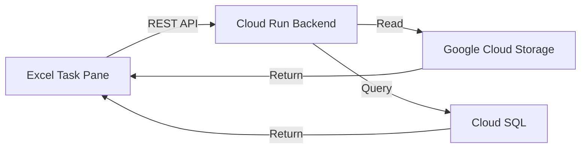

<div align="center">

# 📈 StockData Excel Add-in

**Microsoft Excel task pane add-in for real-time stock data access powered by Google Cloud**


</div>

---

## Overview

A backend service for a Microsoft Excel Add-in that provides seamless access to stock market data stored in Google Cloud Storage. Opens as a **task pane** inside Excel, allowing users to fetch historical price data, financial metrics, and technical indicators — directly into their spreadsheets.

## Architecture



## Features

- 📊 **In-Excel Data Access** — Fetch stock data without leaving your spreadsheet
- 🔌 **REST API Backend** — Clean, fast API endpoints for data retrieval
- ☁️ **Google Cloud Integration** — Leverages GCS for data storage and Cloud Run for compute
- 🔒 **CORS Enabled** — Secure cross-origin communication with the Excel client
- 🚀 **Cloud Run Deployment** — Serverless, auto-scaling backend infrastructure

## API Endpoints

| Endpoint | Method | Description | Parameters |
|----------|--------|-------------|------------|
| `/stocks` | `GET` | Fetch stock price data | `symbol`, `from`, `to`, `columns` |
| `/gcs-files` | `GET` | List available data files | — |
| `/gcs-file` | `GET` | Download a specific data file | `filename` |

## Tech Stack

| Component | Technology |
|-----------|-----------|
| Runtime | Node.js |
| Language | JavaScript |
| Cloud | Google Cloud Platform |
| Compute | Google Cloud Run |
| Storage | Google Cloud Storage |
| Database | Google Cloud SQL (SQL Server) |

## Getting Started

### Prerequisites
- Node.js 18+
- Google Cloud SDK
- GCP service account credentials

### Local Development

```bash
# Clone the repository
git clone https://github.com/SuminPillai/stockdata-excel-addin.git
cd stockdata-excel-addin

# Install dependencies
npm install

# Set environment variables
export PORT=8080
export GOOGLE_APPLICATION_CREDENTIALS="path/to/service-account.json"

# Start the server
npm start
```

### Deployment

This service is designed for deployment on **Google Cloud Run**:

```bash
gcloud run deploy stockdata-excel-addin \
  --source . \
  --region asia-south1 \
  --allow-unauthenticated
```

## Environment Variables

| Variable | Description | Default |
|----------|-------------|---------|
| `PORT` | Server port | `8080` |
| `GOOGLE_APPLICATION_CREDENTIALS` | Path to GCP service account key | — |

## Related Projects

- [**NSE Stock Data Pipeline**](https://github.com/SuminPillai/nse-stock-data-pipeline) — Upstream data ETL pipeline
- [**StockData Google Sheets Add-on**](https://github.com/SuminPillai/stockdata-google-sheets-addon) — Google Sheets version
- [**StockData WebApp**](https://github.com/SuminPillai/stockdata-webapp) — Web interface

---

<div align="center">
  <p>Built with ❤️ by <a href="https://github.com/SuminPillai">Sumin Pillai</a> · <a href="https://alphaquantixanalytics.com">AlphaQuantix Analytics</a></p>
</div>
